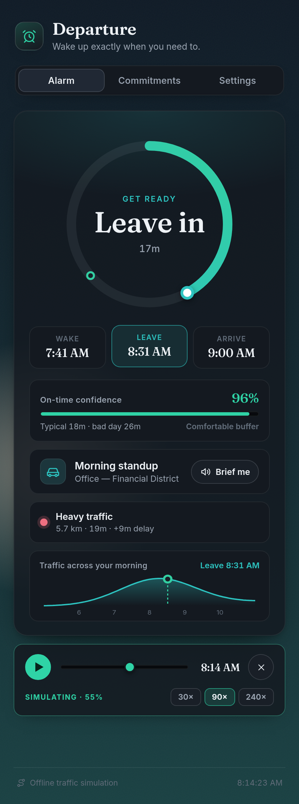
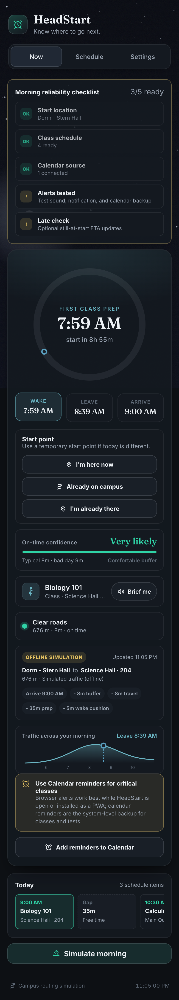

# ⏰ Departure — the smart wake-up alarm

**When should I leave?** and, working backwards, **when should I wake up?**

Departure looks at your first commitment of the day, checks how long the trip
will *actually* take right now (live traffic / transit), and tells you the exact
time to get out of bed — then keeps adjusting as conditions change. No more
setting your alarm for the worst case "just in case."

<p align="center">
  
  &nbsp;
  
</p>

<p align="center">
  <em>A live progress dial counts down your morning on a sky that wakes up with you;
  the Monte-Carlo model tells you how likely you are to actually make it.</em>
</p>

<p align="center">
  
  &nbsp;
  
</p>

<p align="center">
  <em>“Simulate morning” fast-forwards a virtual clock so the whole app — sky, dial,
  phases, confidence, alarm — comes alive on demand.</em>
</p>

---

## How it works

The whole app is one piece of backwards arithmetic, kept honest by a live
travel-time estimate:

```
leaveBy = arriveBy − arrivalBuffer − travelTime(now-ish, traffic-aware)
wakeBy  = leaveBy  − prepTime − wakeComfortMargin
```

- **`arriveBy`** — when your next commitment starts (recurring weekly or one-off).
- **`travelTime`** — a traffic-aware estimate from a pluggable provider.
- **`prepTime`** — how long you need from waking to walking out the door.
- **`arrivalBuffer`** — how early you want to arrive, as a safety margin.

Because `travelTime` is re-fetched on a timer, heavier traffic automatically
pushes your wake time earlier; clear roads let you sleep in. The alarm screen
tracks where you are on that timeline — **sleep → wake → get ready → leave →
en route** — with a live countdown and a matching color.

## Traffic providers

Estimates come through a small `TrafficProvider` interface, so the data source
is swappable:

| Provider | Status | Notes |
| --- | --- | --- |
| **Departure live traffic** | ✅ default | Same-site hosted proxy backed by Google Routes. The provider key stays on the server; requests are cached at an adaptive 1/5/15-minute cadence. |
| **Simulated** | ✅ automatic fallback, zero-config | Offline model: distance × mode speed × a smooth rush-hour congestion curve. A live-provider failure never prevents an alarm plan. |
| **Google Routes (personal key)** | ✅ developer option | Direct Routes API integration for local development or self-hosting. |

Adding another provider (Mapbox, HERE, a transit API…) is just one file that
implements `estimate()` and calls `registerProvider()`.

## Features

- 🧠 **Traffic-aware wake time** that recomputes as congestion changes.
- 🎯 **On-time confidence** — a Monte-Carlo model estimates the probability you'll
  actually arrive on time and, if you're short, how many minutes earlier to leave.
- 🌅 **A living sky** — an animated canvas backdrop that tracks the real time of day:
  stars and a moon at night, a teal dawn glow, the sun arcing across morning.
- ⏩ **Simulate morning** — a demo scrubber that fast-forwards a virtual clock (30–240×)
  so the sky, dial, phases, confidence and alarm all animate on cue. Great for a pitch.
- 🗣️ **Spoken briefing** — the Web Speech API reads your morning out loud (auto at wake).
- ⚡ **Live re-plan alerts** — a toast the moment shifting traffic moves your departure.
- ⭕ **Live progress dial** for the whole morning (wake → leave → arrive) with a moving "now" marker.
- 📈 **Rush-hour sparkline** that plots congestion across the morning and marks your departure.
- 📅 **Recurring, one-off & calendar-imported commitments** — picks whichever comes next.
- 🚗🚉🚲🚶 **Per-commitment travel mode**, each with its own speed & traffic sensitivity.
- 📍 **Home / destination** via place search, device geolocation, or advanced coordinates.
- 🔐 **Private calendar sync** for Google (read-only OAuth) and Apple (server-side CalDAV); no public iCal feed required.
- 👤 **Working accounts** with email/password or a verified Google Account profile.
- 🔔 **Browser/PWA notifications** for wake and leave reminders when permission is granted.
- ⏰ **Native system alarms** — AlarmKit on iOS 26 and Alarm Clock exact alarms on Android, with native notification fallbacks.
- 🔒 **Lock Screen surfaces** — iOS Live Activity, Dynamic Island, StandBy, Lock Screen widgets, and an Android full-screen alarm.
- 📱 **Home Screen widgets** on iOS and Android showing the next wake and leave times.
- 🔁 **Background traffic rescheduling** using iOS Background Tasks and Android WorkManager, plus Android boot/time-change restoration.
- 📆 **Device calendar automation** that imports upcoming timed, physical events after explicit read-only permission.
- ✅ **Alarm verification center** with a real 10-second OS delivery test and permission/capability checks.
- 🟡 **Missed-departure alerts** when live location shows you're still at home after leave time.
- 🔔 **Web-Audio chime** the moment it's time to get up (no audio asset shipped).
- 📲 **Installable PWA** — add to home screen, works offline.
- 💾 **Local-first data** — schedules stay in the signed-in user's browser profile.
- 🎨 Hand-crafted UI (Fraunces + Inter, custom line icons, film grain) with automatic light/dark themes.

## Getting started

```bash
npm install
npm run dev        # start the dev server
```

Then open the printed URL. The app ships with a believable demo (home in the
Mission, a 9am weekday standup downtown) so it's alive on first load.

### Other scripts

```bash
npm test           # run the unit tests (Vitest)
npm run typecheck  # strict TypeScript, no emit
npm run build      # typecheck + production build to dist/
npm run preview    # serve the production build
npm run native:sync    # build the web app and copy it into both native projects
npm run native:ios     # sync, then open the Xcode project
npm run native:android # sync, then open the Android Studio project
```

### Hosted live traffic

Production traffic uses `netlify/functions/traffic.ts`, so the Google credential
never enters the browser or native bundle. Configure these values before a web
or native release:

```bash
# Netlify/server environment only — never prefix this with VITE_
GOOGLE_ROUTES_API_KEY=your-server-routes-key

# Build-time public origin required by native background workers
VITE_DEPARTURE_API_BASE_URL=https://your-departure-site.example
```

The native URL must be absolute HTTPS. The function validates coordinates and
mode, requests traffic-aware routing, and caches results for 1 minute near wake
time, 5 minutes during the approach window, and 15 minutes overnight. The
planner automatically uses its deterministic offline model if the hosted route
cannot be reached.

### Direct Google traffic for local development

1. Enable the **Routes API** in Google Cloud and create an API key.
2. In the app, open **Settings → Traffic source → Google Routes** and paste the
   key. This optional developer path stores the key only in that browser.

### Native iOS and Android apps

The Capacitor projects live in `ios/` and `android/`; the custom
`DepartureNative` bridge owns alarms, calendar reads, background refresh, and
glanceable surfaces instead of depending on WebView timers.

For iOS:

1. Run `npm run native:sync`, then open `ios/App/App.xcodeproj` in Xcode.
2. Choose a Development Team for both **App** and **DepartureWidgets**. Register
   `com.departure.alarm`, `com.departure.alarm.widgets`, and the shared App Group
   `group.com.departure.alarm` in the Apple developer account.
3. Build for iOS 26 to exercise AlarmKit. iOS 16–25 use the time-sensitive
   notification fallback; Live Activities require iOS 16.2 or later.

For Android:

1. Install JDK 21 and Android SDK 36, set `JAVA_HOME` and `ANDROID_HOME`, then
   run `npm run native:sync` and open `android/` in Android Studio.
2. Departure declares `USE_EXACT_ALARM` because precise user-created wake alarms
   are core functionality. A Play Store release must qualify under the exact
   alarm policy. Android 14+ users can separately disable full-screen alarm
   presentation; the in-app reliability center detects that state and links to
   the correct system settings page.

Use **Settings → Alarm reliability → Run 10-second test** on a physical device
before relying on an important alarm. It reports exact-alarm access,
notifications, background refresh, hosted traffic, widget/Lock Screen support,
and whether the current plan has been synchronized.

### Using private Google Calendar sync

The Google connector uses Google Identity Services with the
`calendar.events.readonly` scope, then reads upcoming events from the signed-in
user's primary calendar. Users do not need to publish their calendar or paste an
iCal URL.

The production site ships with its authorized Google OAuth web client. Other
deployments can override it with `VITE_GOOGLE_CLIENT_ID`; that client must list
the deployment URL as an authorized JavaScript origin. Enable the Google
Calendar API and add the read-only Calendar scope to the consent screen. The
same client ID powers the clean **Continue with Google** account button and the
separate **Connect Google Calendar** permission. Developer credentials are
never shown or requested in the product UI.

### Using Apple Calendar

Apple does not grant iCloud Calendar access through ordinary **Sign in with
Apple**. Departure therefore uses a same-site Netlify Function and Apple's
CalDAV service. The user enters their Apple Account email and an app-specific
password; the function uses it only for that read-only sync and does not save
it. The calendar stays private. A private `.ics` file remains available as an
offline fallback.

The Apple connector is deployed from `netlify/functions/apple-calendar.ts` via
`netlify.toml`. Local end-to-end testing of that function should use `netlify
dev`; plain `vite` serves only the frontend.

### Notifications and live location

Departure can request browser notifications from Settings and schedule wake/leave
reminders for the current plan through the browser or installed PWA where
supported. Web notification delivery still depends on browser and
operating-system rules, so the alarm screen can also download native calendar
reminder events for system-level alerts.

Live missed-departure checks use browser geolocation only after the planned leave
time and before the arrival time. The app stores the on/off preference locally;
current coordinates are kept in memory for the active page session.

In the native app, **Device calendar automation** is a separate explicit opt-in.
It reads the next 14 days, ignores all-day, cancelled, and remote-only events,
and turns physical events into editable commitments. Access remains read-only
and can be disabled from the same reliability panel.

Learned place suggestions are stored only in this browser and can be cleared from
Settings.

### Place search

Destination search uses OpenStreetMap's Nominatim search endpoint for
user-triggered searches, with results selected into the app's local commitment
state. Coordinates remain available under **Advanced coordinates** for edge
cases or precise corrections.

## Architecture

```
src/
  core/                 framework-agnostic domain logic (fully unit-tested)
    types.ts            Place, Commitment, Settings, DeparturePlan …
    geo.ts              haversine distance + road-detour factor
    time.ts             time parsing, next-occurrence, commitment selection
    departure.ts        the backwards timeline engine + phase resolution
    confidence.ts       Monte-Carlo on-time probability + spoken briefing text
    calendar.ts         iCal import → editable commitments
    traffic/
      provider.ts       TrafficProvider interface + registry
      hosted.ts         same-site traffic proxy client (default)
      simulated.ts      offline rush-hour model and automatic fallback
      google.ts         Google Routes API implementation
  native/               typed Capacitor bridge used by the React app
  state/store.ts        localStorage persistence + demo seed
  hooks/                planning, adaptive refresh, native sync, calendar automation
  components/           AlarmCard, RadialTimeline, SkyScene, DemoBar,
                        ConfidenceMeter, TrafficSparkline, forms …
tests/                  Vitest: geo, time, simulation, engine, confidence, calendar
ios/                    AlarmKit, BackgroundTasks, EventKit, Live Activity + widgets
android/                AlarmManager, WorkManager, CalendarContract + app widget
netlify/functions/      hosted traffic and private calendar server functions
```

The `core/` layer has no React or DOM dependencies, which is why the timeline
math, traffic model and confidence engine are covered by fast, deterministic
unit tests.

## Tech

React 18 · TypeScript (strict) · Vite · Vitest · Capacitor · Swift/SwiftUI ·
Java/AndroidX · Netlify Functions · PWA. No web UI framework — the design system
is hand-written CSS with the Fraunces + Inter type pairing. The living sky is a
`<canvas>`; the briefing uses the Web Speech API; both degrade gracefully where
unsupported.

## License

MIT — see [LICENSE](./LICENSE).
