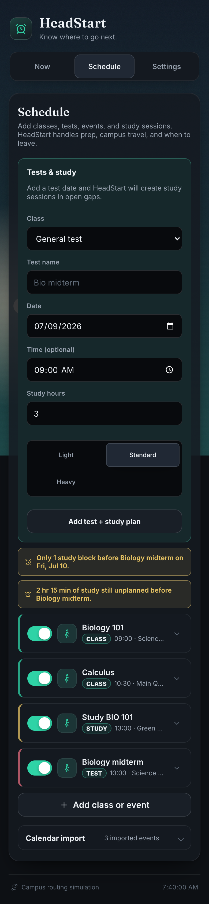
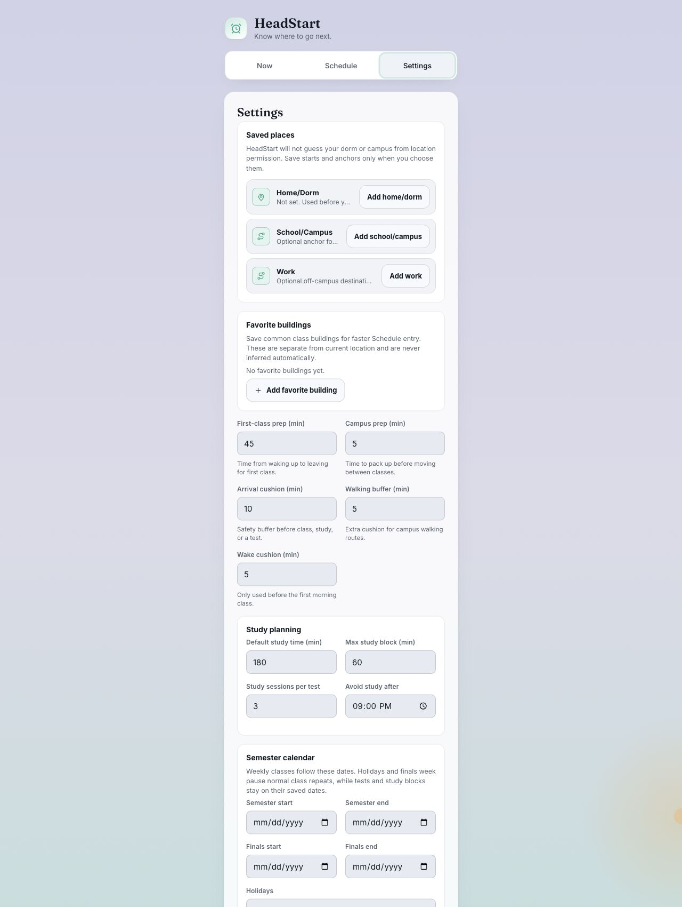

# HeadStart - student schedule assistant

HeadStart helps students answer the useful daily questions:

- What is my next class, test, study block, or event?
- Which building and room am I going to?
- When should I prep, leave, and arrive?
- If I am still at my start point, what is my updated ETA?
- When do I need to study before a test?

The app is pivoted toward a campus workflow: first morning class gets the
wake/prep treatment, later classes use the previous class or current location as
the start point, and tests can generate study sessions inside open gaps.

## Screenshots

<p align="center">
  
  &nbsp;
  
</p>

<p align="center">
  
</p>

## How It Works

HeadStart keeps the old reliable backwards-planning engine, but applies it to a
student day:

```text
leaveBy = classStart - arrivalBuffer - travelTime
prepBy  = leaveBy - prepTime
```

- First class of the day uses the full first-class prep setting.
- Later classes use a smaller campus prep setting and usually start from the
  previous class building.
- Live/current location can temporarily override the start point without being
  saved as Home/Dorm.
- Completed or skipped study sessions stop appearing as the next thing to do.

## Features

- Next Class dashboard with Prep, Leave, and Arrive timing chips.
- Today strip for a quick scan of classes, tests, events, and study blocks.
- Schedule editor for classes, events, tests, and study sessions.
- Building search powered by OpenStreetMap, biased around a saved campus when
  available.
- Explicit saved places for Home/Dorm, School/Campus, and Work. HeadStart does
  not infer or save home from location permission.
- Temporary start controls: "I'm leaving from here" and "Already on campus."
- Late-departure check that can turn the dashboard yellow and show an updated
  arrival time when the user has not left yet.
- Test planner inside Schedule that creates study sessions in open gaps.
- Private Google Calendar import through OAuth, with no public iCal URL
  required.
- Apple Calendar connector hook for a secure backend, plus `.ics` import
  fallback.
- Browser/PWA notifications and downloadable calendar reminder backups.
- Local-first storage in `localStorage`.

## Getting Started

```bash
npm install
npm run dev
```

Open the printed local URL.

## Checks

```bash
npm test
npm run typecheck
npm run build
```

## Calendar Connectors

### Google Calendar

The Google connector uses Google Identity Services with
`calendar.events.readonly`. Users sign in with Google and do not need to publish
their calendar or paste an iCal URL.

For production, set `VITE_GOOGLE_CLIENT_ID` to a Google OAuth web client ID with
the deployed app URL listed as an authorized JavaScript origin.

### Apple Calendar

Apple Calendar does not expose the same browser OAuth event API as Google
Calendar. The Apple card can redirect to a secure backend connector by setting
`VITE_CALENDAR_CONNECTOR_URL`; the frontend calls
`{connectorUrl}/apple/start?returnTo=...`.

That backend should handle Apple CalDAV or a trusted calendar aggregation
provider and return events without asking users to make their calendar public.
Private `.ics` import remains available as a fallback.

## Location And Privacy

Location permission is used only for explicit actions or live checks:

- "Use current location" in a picker fills that one field and is not added to
  learned building history.
- "I'm leaving from here" temporarily plans from current location for the active
  session.
- Live late-departure checks keep current coordinates in memory only while the
  page is open.

Saved Home/Dorm, School/Campus, and Work places are only created when the user
chooses to save them.

## Architecture

```text
src/
  core/                 framework-agnostic domain logic
    schedule.ts         student items, occurrences, study planning
    departure.ts        prep/leave/arrival planning engine
    confidence.ts       on-time probability and spoken briefing text
    calendar.ts         calendar import into schedule items
    traffic/            simulated and Google Routes providers
  state/store.ts        localStorage persistence and migration
  hooks/                planning, clock, notifications, location checks
  components/           dashboard, schedule form, settings, connectors
tests/                  Vitest coverage for domain logic and flows
```

## Tech

React 18, TypeScript, Vite, Vitest, PWA, hand-written CSS, OpenStreetMap
Nominatim search, optional Google Routes, optional Google Calendar OAuth.

## License

MIT - see [LICENSE](./LICENSE).
