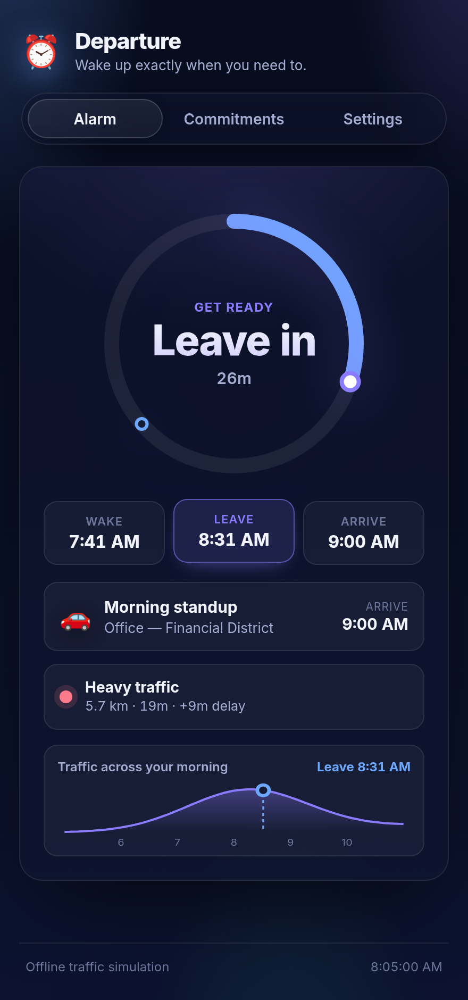
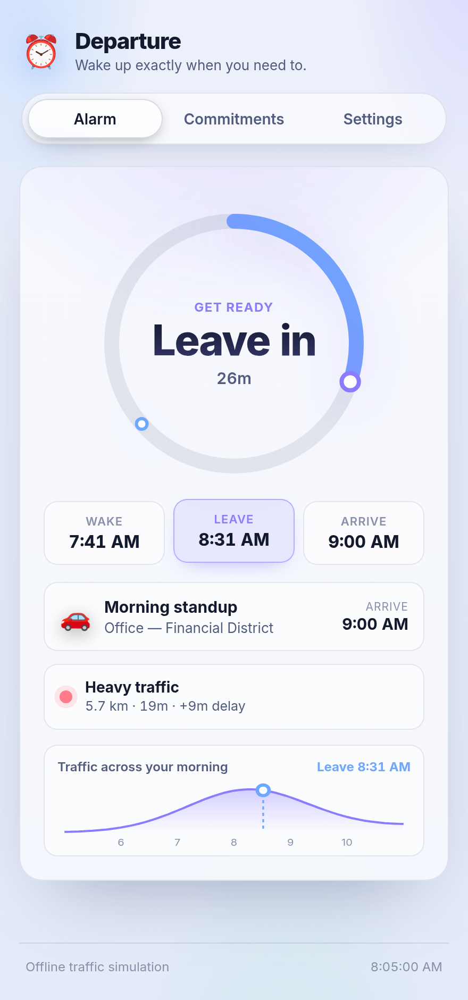

# ⏰ Departure — the smart wake-up alarm

**When should I leave?** and, working backwards, **when should I wake up?**

Departure looks at your first commitment of the day, checks how long the trip
will *actually* take right now (live traffic / transit), and tells you the exact
time to get out of bed — then keeps adjusting as conditions change. No more
setting your alarm for the worst case "just in case."

<p align="center">
  
  &nbsp;
  
</p>

<p align="center">
  <em>A live progress dial counts down your morning, colour-coded by phase, while the
  sparkline shows the whole rush-hour curve with your departure marked at the sweet spot.</em>
</p>

---

## How it works

The whole app is one piece of backwards arithmetic, kept honest by a live
travel-time estimate:

```
leaveBy = arriveBy − arrivalBuffer − travelTime(now-ish, traffic-aware)
wakeBy  = leaveBy  − prepTime − wakeComfortMargin
```

- **`arriveBy`** — when your next commitment starts (recurring weekly or one-off).
- **`travelTime`** — a traffic-aware estimate from a pluggable provider.
- **`prepTime`** — how long you need from waking to walking out the door.
- **`arrivalBuffer`** — how early you want to arrive, as a safety margin.

Because `travelTime` is re-fetched on a timer, heavier traffic automatically
pushes your wake time earlier; clear roads let you sleep in. The alarm screen
tracks where you are on that timeline — **sleep → wake → get ready → leave →
en route** — with a live countdown and a matching color.

## Traffic providers

Estimates come through a small `TrafficProvider` interface, so the data source
is swappable:

| Provider | Status | Notes |
| --- | --- | --- |
| **Simulated** | ✅ default, zero-config | Offline model: distance × mode speed × a smooth rush-hour congestion curve. Deterministic, so no flicker. |
| **Google Routes** | ✅ implemented, key-gated | Real live-traffic routing via the Routes API. Paste a key in **Settings** to enable; otherwise the app falls back to the simulation. |

Adding another provider (Mapbox, HERE, a transit API…) is just one file that
implements `estimate()` and calls `registerProvider()`.

## Features

- 🧠 **Traffic-aware wake time** that recomputes as congestion changes.
- ⭕ **Live progress dial** for the whole morning (wake → leave → arrive) with a moving "now" marker.
- 📈 **Rush-hour sparkline** that plots congestion across the morning and marks your departure.
- 📅 **Recurring & one-off commitments** — picks whichever comes next.
- 🚗🚉🚲🚶 **Per-commitment travel mode**, each with its own speed & traffic sensitivity.
- 📍 **Home / destination** via presets, manual coordinates, or device geolocation.
- 🔔 **Web-Audio chime** the moment it's time to get up (no audio asset shipped).
- 💾 **Local-first** — everything persists in `localStorage`; no account, no server.
- 🎨 Polished, responsive UI with automatic light/dark themes.

## Getting started

```bash
npm install
npm run dev        # start the dev server
```

Then open the printed URL. The app ships with a believable demo (home in the
Mission, a 9am weekday standup downtown) so it's alive on first load.

### Other scripts

```bash
npm test           # run the unit tests (Vitest)
npm run typecheck  # strict TypeScript, no emit
npm run build      # typecheck + production build to dist/
npm run preview    # serve the production build
```

### Using live Google traffic

1. Enable the **Routes API** in Google Cloud and create an API key.
2. In the app, open **Settings → Traffic source → Google Routes** and paste the
   key. It's stored only in your browser.

## Architecture

```
src/
  core/                 framework-agnostic domain logic (fully unit-tested)
    types.ts            Place, Commitment, Settings, DeparturePlan …
    geo.ts              haversine distance + road-detour factor
    time.ts             time parsing, next-occurrence, commitment selection
    departure.ts        the backwards timeline engine + phase resolution
    traffic/
      provider.ts       TrafficProvider interface + registry
      simulated.ts      offline rush-hour model (default)
      google.ts         Google Routes API implementation
  state/store.ts        localStorage persistence + demo seed
  hooks/                useNow, usePlan, useAlarmSound
  components/           AlarmCard, TimelineBar, TrafficBadge, forms …
tests/                  Vitest coverage of geo, time, simulation & engine
```

The `core/` layer has no React or DOM dependencies, which is why the timeline
math and traffic model are covered by fast, deterministic unit tests.

## Tech

React 18 · TypeScript (strict) · Vite · Vitest. No UI framework — the design
system is hand-written CSS.

## License

MIT — see [LICENSE](./LICENSE).
